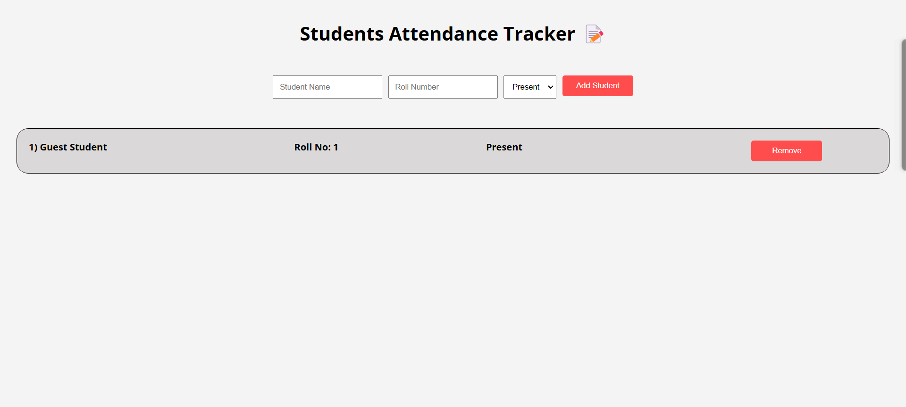

# Students Attendance Tracker 📝

This project is a simple **Students Attendance Tracker** built using **HTML**, **CSS**, and **JavaScript**. It allows users to dynamically add and remove students along with their roll numbers and attendance status. The students' information is displayed in a neatly formatted list.

## Screenshot

## Features

- Add a student's **name**, **roll number**, and **attendance status** (Present/Absent).
- Display the list of students with their respective details.
- Option to **remove** students from the list.
- Responsive and user-friendly interface.

## Technologies Used

- **HTML**: To structure the content of the web page.
- **CSS**: For styling the layout and making it visually appealing.
- **JavaScript**: To add interactive features like adding and removing students from the list.

